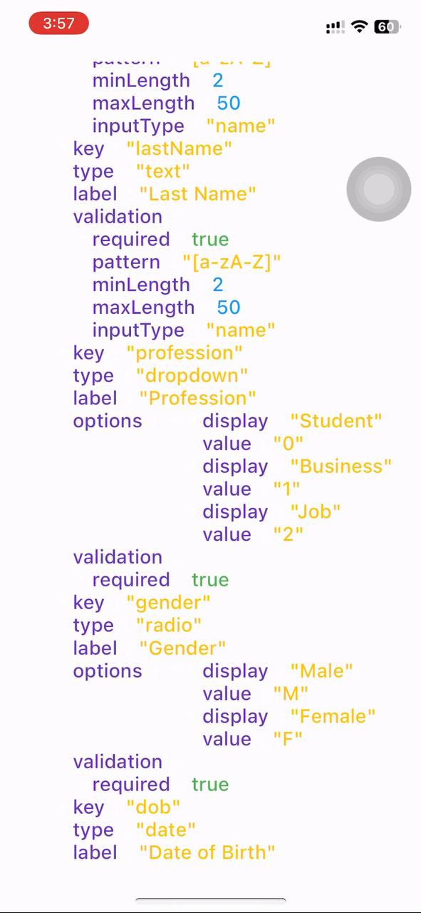
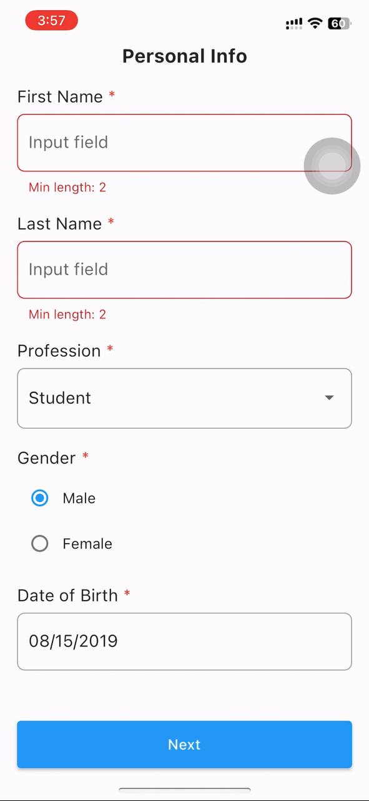

#### Easy to implement dynamic forms in Flutter

Includes:

- Usable for multiple pages for same form purpose (Example: It can be for sign up form or KYC form containing fields in multiple pages)
- Form fields to support widgets like text form field, drop down button, radio button, date picker
- Suports field validation too including regex and min/max length validation
- Supports keyboard type for text field
- And most importantly to implement it in easy/simple way

App Screenshots

  

  

  

